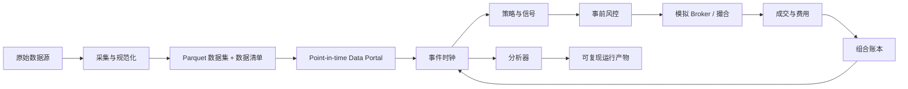

# 回测系统完整技术方案

> 状态：设计提案 v1  
> 日期：2026-08-11  
> 适用范围：`quant_service` 的研究回测、仿真交易及未来实盘共享内核

## 1. 结论与关键决策

回测系统采用 **事件驱动执行内核 + 列式数据研究层**：

- Polars/Arrow 用于数据清洗、因子和信号的批量计算；
- Parquet 是规范化行情与回测明细的主要文件格式；
- DuckDB 用于本地查询、数据检查和报告聚合，不作为撮合状态机；
- 订单、成交、费用、现金、持仓和估值统一经过事件驱动内核；
- 策略只能读取当前时点已经可获得的数据；
- 每次运行保存配置、代码版本、数据版本和完整交易流水，能够复现与审计；
- 第一条生产级路径先支持多资产 Bar 回测、只做多、市场单，再扩展限价单、做空和分钟级撮合。

现有 MVP 已验证“收盘产生信号、下一根开盘成交”的最小时序，但仍是单资产原型。后续会保留兼容适配器，逐步替换内部实现，不把当前类视为稳定公共 API。

## 2. 目标与非目标

### 2.1 目标

1. **正确**：避免前视偏差、幸存者偏差和错误复权；资金与持仓守恒。
2. **真实**：显式模拟手续费、滑点、交易限制、部分成交和公司行为。
3. **可复现**：相同代码、配置、数据清单和随机种子产生相同结果。
4. **可解释**：从最终收益可以追溯到每次信号、订单、成交和记账分录。
5. **可扩展**：数据源、交易日历、费用模型、撮合模型和策略彼此解耦。
6. **可迁移**：回测和仿真/实盘共享策略、订单、风控及组合语义。
7. **可测试**：会计恒等式、事件时序和边界条件均可自动验证。

### 2.2 第一阶段非目标

- tick 级盘口重建和交易所撮合队列模拟；
- 高频交易的微秒级延迟建模；
- 分布式集群回测；
- 期权 Greeks、保证金组合优化和复杂衍生品定价；
- 用回测系统直接承担生产实盘的高可用订单网关。

## 3. 总体架构



### 3.1 分层职责

| 层 | 负责 | 不负责 |
|---|---|---|
| 数据采集 | 拉取、原样落盘、来源记录 | 生成策略信号 |
| 规范化 | 字段映射、类型、时区、质量校验 | 隐式填补未知数据 |
| Data Portal | 按当前时点提供可见数据 | 暴露未来数据 |
| 策略 | 生成目标仓位或订单意图 | 修改现金与持仓 |
| 风控 | 校验/缩减/拒绝订单 | 虚构成交 |
| Broker | 订单状态、撮合、滑点、费用 | 计算策略指标 |
| Portfolio/Ledger | 现金、持仓、成本、PnL、估值 | 决定策略方向 |
| Analyzer | 绩效、风险、归因、报告 | 改变回测状态 |

## 4. 数据设计

### 4.1 规范化 Bar 契约

每一行至少包含：

| 字段 | 类型 | 语义 |
|---|---|---|
| `instrument_id` | string | 稳定内部标识，不直接依赖供应商代码 |
| `event_time` | timestamp with timezone | 市场事件发生/Bar 结束时间 |
| `available_time` | timestamp with timezone | 数据最早可被策略看到的时间 |
| `session` | date | 所属交易日 |
| `open/high/low/close` | decimal/float | 未复权价格，必须大于 0 |
| `volume` | integer/float | 成交量，必须非负 |
| `turnover` | decimal, nullable | 成交额 |
| `currency` | string | 计价币种 |
| `is_suspended` | bool | 是否停牌/无可交易报价 |
| `source` | string | 数据来源 |
| `ingested_at` | timestamp | 进入本系统的时间 |

`event_time` 与 `available_time` 必须分开：财务数据、指数成分和修订数据经常在事件发生后才可获得。策略查询条件始终是 `available_time <= engine.now`。

### 4.2 其他 Point-in-time 数据

- `Instrument`：上市/退市时间、市场、币种、最小价格单位、交易单位。
- `TradingCalendar`：交易日、开闭市、午休、提前收市、时区。
- `CorporateAction`：分红、拆并股、送转、配股、合约换月。
- `UniverseMembership`：标的进入和离开股票池的有效区间及公布时间。
- `BenchmarkConstituent`：指数成分和权重的历史版本。
- `FXRate`：多币种估值汇率及其可获得时间。

### 4.3 原始价、复权价与公司行为

- 撮合和账本只使用**当时真实可交易的未复权价格**；
- 策略可请求复权历史用于指标计算，但复权规则必须带版本；
- 分红和拆股通过公司行为事件改变现金、数量和成本，不靠修改历史成交；
- 任何使用“后复权”序列的策略，必须确认调整因子在历史时点可构造。

### 4.4 存储布局

```text
data/
├── raw/<provider>/<dataset>/<ingestion_date>/...
├── curated/bars/<market>/<frequency>/<year>/part-*.parquet
├── curated/instruments/...
├── curated/calendars/...
├── curated/corporate_actions/...
└── manifests/<dataset_version>.json
```

每个数据清单记录 schema 版本、文件路径、行数、时间范围、SHA-256、供应商与采集时间。原始层只追加，不原地覆盖。Parquet 提供压缩列式存储；DuckDB 和 Polars 都可做列裁剪和过滤下推，适合本地研究数据集。

## 5. 回测事件模型

### 5.1 事件类型

- `SessionStarted`
- `CorporateActionApplied`
- `MarketDataPublished`
- `StrategyEvaluated`
- `OrderSubmitted`
- `OrderAccepted` / `OrderRejected`
- `OrderCancelled` / `OrderExpired`
- `FillGenerated`
- `PortfolioMarked`
- `SessionEnded`

事件都包含 `run_id`、单调递增 `sequence`、事件时间和处理时间。事件排序禁止依赖字典遍历或线程调度。

### 5.2 日频默认时序

每个交易日严格按以下阶段执行：

1. 应用开盘前已生效的公司行为；
2. 用当日开盘行情撮合此前已接受的订单；
3. 生成成交、扣除费用并更新账本；
4. 接收当日 Bar 的收盘信息并按收盘价估值；
5. 策略读取截至当前 `available_time` 的数据；
6. 生成目标仓位或订单，经过风控后进入待执行队列；
7. 保存当日快照和分析器数据。

因此，用第 T 日收盘数据产生的普通市场单，最早只能在第 T+1 个可交易日开盘成交。若用户明确选择 `market_on_close`，必须由更细粒度数据证明订单在收盘撮合截止前已经产生，日 Bar 模式默认不提供该能力。

### 5.3 同时刻优先级

固定优先级为：公司行为 → 订单到期/取消 → 行情可用 → 撮合 → 成交记账 → 估值 → 策略 → 风控 → 新订单入队 → 快照。优先级写入测试，不能由策略更改。

## 6. 策略接口

推荐公共接口：

```python
class Strategy(Protocol):
    def initialize(self, context: StrategyContext) -> None: ...
    def on_bar(self, context: StrategyContext, data: DataSlice) -> None: ...
    def on_fill(self, context: StrategyContext, fill: Fill) -> None: ...
    def finalize(self, context: StrategyContext) -> None: ...
```

`StrategyContext` 只暴露：

- 当前时间、运行参数和只读组合快照；
- `history()`、`current()` 等受时间游标保护的数据查询；
- `order()`、`order_target_quantity()`、`order_target_percent()`；
- 可复现随机数生成器。

策略不得直接修改 Portfolio，也不能取得底层完整 DataFrame。批量预计算的因子必须包含 `available_time`，进入 Data Portal 后仍受同样的时间过滤。

## 7. 订单、风控与撮合

### 7.1 订单模型

核心字段：`order_id`、`instrument_id`、`side`、`quantity`、`order_type`、`limit_price`、`stop_price`、`time_in_force`、`submitted_at`、`eligible_at`、`status`、`strategy_tag`。

状态机：

```text
CREATED -> ACCEPTED -> PARTIALLY_FILLED -> FILLED
                    -> CANCELLED
                    -> EXPIRED
CREATED/ACCEPTED -> REJECTED
```

订单 ID 由 `run_id + sequence` 确定性生成。第一阶段实现 `MARKET + DAY`；第二阶段实现 `LIMIT/STOP + GTC/IOC`。

### 7.2 事前风控

- 可用现金和购买力；
- 单标的最大权重/数量；
- 总杠杆、净敞口和行业敞口；
- 价格、数量、最小交易单位与涨跌停合法性；
- 停牌、退市和不可交易状态；
- 单日换手和订单金额上限；
- 风控结果必须是接受、调整或拒绝，并记录原因。

### 7.3 撮合模型

采用可插拔 `FillModel`：

1. `NextOpenFillModel`：日频默认，下一交易日开盘成交。
2. `BarFillModel`：限价/止损订单根据 OHLC 区间判断是否可能成交。
3. `VolumeParticipationFillModel`：成交量不超过该 Bar 市场量的一定比例，支持部分成交。

仅有 OHLC 时无法知道 Bar 内价格路径。如果同一 Bar 同时触发止损和止盈，默认采用保守规则（对策略较差的成交顺序）或标记为歧义并拒绝计算，禁止自动选择最有利结果。

### 7.4 滑点与市场冲击

按复杂度逐步加入：

- 固定基点：`price * (1 ± bps / 10000)`；
- 半买卖价差；
- 随参与率和波动率变化的冲击模型；
- 最大成交量参与率和订单跨 Bar 排队。

滑点方向必须总是不利于策略；零滑点只能由配置显式指定。

### 7.5 费用模型

`FeeModel` 根据市场、方向、成交额、数量和日期返回明细：佣金、最低佣金、印花税、交易所/监管费、过户费等。费率必须配置化并带生效区间，不能把当前费率回填到所有历史时期。

## 8. 组合账本与估值

### 8.1 记账原则

- 行情/指标计算使用 `float64`；
- 成交金额、现金和费用使用定点数或 `Decimal`，并按币种/市场规则舍入；
- 每次成交产生不可变账本分录；
- Position 是账本派生状态，不是唯一事实源；
- 支持总成本法作为默认成本口径，税务批次另做扩展。

### 8.2 必须始终成立的不变量

```text
equity = cash + sum(position.market_value) + receivables - liabilities
buy_cash_change  = -(notional + fees)
sell_cash_change = +(notional - fees)
position_quantity = sum(signed_fill_quantity after corporate actions)
```

每个事件处理后检查轻量不变量；完整账本对账在每个 session 结束时执行。允许的误差只来自明确的舍入规则。

### 8.3 估值

- 默认使用最近一个可用收盘价；
- 停牌时沿用最近可用价格并标记 stale；
- 无法估值的持仓不能静默当作 0；
- 多币种组合使用当时可用 FX 汇率折算，并分别保存本币和基准币金额。

## 9. 偏差防护

系统必须自动或通过验收测试防止：

| 偏差 | 防护措施 |
|---|---|
| 前视偏差 | `available_time` 游标、下一时点执行、禁止暴露完整未来数组 |
| 幸存者偏差 | 使用历史股票池成员区间，保留退市标的 |
| 复权错误 | 撮合用原始价，公司行为进账本，策略复权序列独立 |
| 数据修订偏差 | 保存 vintage/ingestion 版本，按当时可得版本查询 |
| 参数过拟合 | 时间序列切分、walk-forward、样本外锁定 |
| 成本遗漏 | 非零默认费用和滑点，报告必须展示成本占比 |
| 容量幻觉 | 参与率限制、成交额/换手报告、冲击情景分析 |
| 基准错配 | 基准币种、交易日和现金流口径一致 |

额外提供 `LookaheadGuard`：策略每次查询记录请求时间范围；任何越过 `engine.now` 或使用晚到数据的请求立即失败，不仅写警告。

## 10. 配置与公共 API

### 10.1 运行配置示例

```yaml
schema_version: 1
run:
  name: sma_cross_baseline
  seed: 7
data:
  dataset_version: bars-cn-etf-daily-v1
  start: 2018-01-01
  end: 2025-12-31
  frequency: 1d
  universe: cn_etf_baseline
strategy:
  class: quant_service.strategies.sma_cross:SmaCrossStrategy
  params:
    fast_window: 20
    slow_window: 60
portfolio:
  base_currency: CNY
  initial_cash: 1000000
execution:
  fill_model: next_open
  slippage_model: fixed_bps
  slippage_bps: 2
  fee_model: configured_market_fee
risk:
  max_position_weight: 1.0
  max_gross_exposure: 1.0
benchmark:
  instrument_id: benchmark_placeholder
```

配置在运行前完成 schema 校验，未知字段报错。日期、币种、费率、复权模式和随机种子不得使用隐藏默认值。

### 10.2 应用 API

```python
request = BacktestRequest.from_file("configs/sma_cross.yaml")
result = BacktestRunner().run(request)

print(result.run_id)
print(result.summary)
```

CLI：

```bash
quant-service data validate --dataset bars-cn-etf-daily-v1
quant-service backtest run --config configs/sma_cross.yaml
quant-service backtest inspect <run_id>
quant-service report build <run_id>
```

## 11. 结果、指标与报告

### 11.1 运行产物

```text
artifacts/runs/<run_id>/
├── config.resolved.yaml
├── manifest.json
├── summary.json
├── equity.parquet
├── positions.parquet
├── orders.parquet
├── fills.parquet
├── ledger.parquet
├── events.jsonl.zst
├── quality.json
└── report.html
```

`run_id` 由规范化配置、代码版本、数据清单哈希和策略版本共同生成。日志中的事件序列足以重放关键组合状态。

### 11.2 第一版指标

- 累计收益、年化收益、年化波动率；
- 最大回撤、回撤持续时间、Calmar；
- Sharpe、Sortino（无风险利率必须显式配置）；
- 总换手、平均敞口、最大杠杆；
- 交易次数、胜率、盈亏比、Profit Factor、平均持有期；
- 总手续费、滑点成本及其占毛收益比例；
- 相对基准收益、跟踪误差和信息比率；
- 月度/年度收益表和水下曲线。

报告必须同时展示绝对金额与比例，并标注数据区间、频率、年化因子、费用模型和是否包含未实现收益。

## 12. 可复现与可审计

一次有效回测必须记录：

- 完整解析后的配置；
- Git commit 和工作区是否有未提交改动；
- Python 与依赖锁文件摘要；
- 输入数据 manifest 哈希；
- 策略类路径和参数；
- 随机种子；
- 开始/结束时间、耗时、告警和数据质量结果。

若缺少任一关键标识，运行结果标记为 `NON_REPRODUCIBLE`，不能作为正式研究结论。

## 13. 测试方案

### 13.1 测试层次

1. **单元测试**：订单状态机、费用、滑点、公司行为、PnL、指标。
2. **时序测试**：T 日信号不能以 T 日开盘/收盘价成交；晚到数据不可见。
3. **性质测试**：随机交易序列下资金守恒、无负数量、事件序号单调。
4. **Golden tests**：固定小数据集的订单、成交、账本和权益逐行比对。
5. **差分测试**：简单 buy-and-hold 用独立公式计算，与引擎结果对照。
6. **集成测试**：数据读取 → 策略 → 撮合 → 报告完整闭环。
7. **性能测试**：固定硬件和数据集记录吞吐量、内存峰值与回归阈值。

性质测试建议使用 Hypothesis，特别适合验证金融账本中“任何合法交易序列都必须守恒”的性质。

### 13.2 必测边界场景

- 空数据、重复时间戳、乱序和不同时区；
- 上市首日、退市、停牌、无成交量；
- 现金不足、最小佣金、零碎股和最小交易单位；
- 缺失 Bar、多市场假日与提前收市；
- 拆股、现金分红、除权日恰有挂单；
- 同一 Bar 触发多个条件造成的价格路径歧义；
- 最后一根 Bar 产生但无法成交的订单；
- 费用大于成交所得、负价格和异常极值。

### 13.3 合并门槛

- 核心领域代码分支覆盖率不低于 90%；
- 所有会计不变量、时序测试和 Golden tests 必须通过；
- 无未解释的数据质量错误；
- 性能相较基线下降超过 15% 时必须说明原因。

## 14. 性能与扩展策略

先保证语义正确，再建立基准并优化：

- 数据扫描使用 Polars lazy/Arrow dataset 或 DuckDB 过滤与列裁剪；
- 因子批量计算，结果按 `instrument_id + available_time` 流入事件内核；
- 行情按时间有序批量送入，避免每根 Bar 做磁盘随机读取；
- 订单、成交和账本使用紧凑结构，报告生成与撮合分离；
- 参数扫描采用进程级隔离，每个进程独立 DuckDB 连接与随机种子；
- 只有基准证明 Python 成为瓶颈后，才把热点迁移到 NumPy/Polars/Rust。

第一阶段性能验收目标：在约 500 万条日/分钟 Bar 的固定基准集上完成一次简单策略回测，峰值内存不超过 2 GB，运行时间目标不超过 60 秒。该数字是工程目标，需在当前机器建立基线后确认。

## 15. 推荐技术栈

| 类别 | 选择 | 用途 |
|---|---|---|
| 语言 | Python 3.11+ | 策略、领域模型和编排 |
| 列式内存/交换 | Apache Arrow | 统一列式数据边界 |
| 数据文件 | Parquet | 行情、成交、持仓和权益明细 |
| 变换 | Polars lazy API | 清洗、因子和批量信号 |
| 本地查询 | DuckDB 独立连接 | 数据检查、分析和报告聚合 |
| 配置校验 | Pydantic 或严格 dataclass schema | 配置与领域边界校验 |
| 测试 | pytest + Hypothesis | 示例测试与性质测试 |
| 报告 | Plotly/Jinja2（后续） | 自包含 HTML 报告 |

领域核心不依赖 DataFrame 类型；第三方库被限制在数据适配器、批量计算和报告层。这能降低升级成本，也便于用小型纯 Python fixture 精确测试撮合与会计。

## 16. 代码目录规划

```text
src/quant_service/
├── domain/               # 事件、订单、成交、金额、持仓等纯领域对象
├── data/
│   ├── schemas/          # Arrow/schema 定义
│   ├── adapters/         # CSV、Parquet、供应商适配器
│   ├── portal.py         # point-in-time 查询
│   └── quality.py
├── engine/
│   ├── clock.py
│   ├── dispatcher.py
│   └── runner.py
├── execution/
│   ├── broker.py
│   ├── fill_models.py
│   ├── slippage.py
│   └── fees.py
├── portfolio/
│   ├── ledger.py
│   ├── positions.py
│   └── valuation.py
├── risk/
├── strategies/
├── analytics/
│   ├── metrics.py
│   └── report.py
├── config/
└── cli.py
```

## 17. 分阶段实施与验收

### M1：可信单资产内核

- 重构领域对象、确定性事件队列、订单状态机和 Decimal/定点账本；
- 市场单、下一开盘成交、费用/滑点接口；
- CSV 输入、完整订单/成交/权益产物；
- 时序、守恒、Golden tests。

验收：固定样例可逐笔人工对账；同一配置重复运行结果逐字节一致。

### M2：多资产研究闭环

- Parquet/Arrow schema、Data Portal、交易日历；
- 多资产目标权重、再平衡、基准和报告；
- 数据质量门禁、运行 manifest 和 `run_id`。

验收：多资产 buy-and-hold、定期再平衡可与独立计算结果一致。

### M3：真实市场约束

- 部分成交、成交量限制、限价/止损；
- 市场费用、最小交易单位、停牌/涨跌停；
- 分红、拆股和退市；
- 容量与成本情景分析。

验收：每个市场规则都有日期化 fixture 和账本断言。

### M4：规模化研究

- Polars 因子管线、参数扫描、walk-forward；
- 性能基线、缓存、并行隔离；
- HTML 报告、实验比较和结果索引。

验收：满足性能目标，正式研究运行均可复现且样本外区间不可被训练阶段读取。

### M5：仿真交易对齐

- 抽象 Broker/MarketData 接口并接入纸面交易；
- 订单幂等、重试、对账和恢复；
- 同一策略在回测与仿真中仅替换数据和执行适配器。

验收：shadow run 的事件、订单状态和组合快照能够完整审计。

## 18. 当前 MVP 的迁移方式

当前 `engine.py`、`models.py`、`strategy.py` 保留为可执行基准：

1. 先增加新领域包和 Golden tests，不立即删除旧 API；
2. 用 `LegacyStrategyAdapter` 让现有 `SmaCrossStrategy` 运行在新内核；
3. 新旧引擎在固定 fixture 上做差分测试；
4. 新引擎覆盖当前能力后切换 CLI；
5. 最后删除旧内部实现，发布一次明确的 API 变更。

## 19. 开工前仍需确定的业务参数

架构本身不依赖具体市场，但下面四项会决定日历、费用和成交规则：

1. 首个市场与资产类型；
2. 首个频率（日频或分钟）；
3. 数据来源和可用字段；
4. 是否允许做空、杠杆和多币种。

本项目已确定首期同时支持 **A 股与美股、日频、板块研究优先、ETF 与个股并存**。两地市场先分别回测和报告，默认只做多、无杠杆、目标权重下单；完成多币种账本和 FX 数据后再合并为跨市场组合。详细数据方案见 [market_data_plan_cn_us.md](market_data_plan_cn_us.md)。

## 20. 参考依据

- [DuckDB Python API](https://duckdb.org/docs/stable/clients/python/overview)：支持直接查询 Parquet、Arrow、Polars，并建议库代码使用独立连接而非共享全局连接。
- [DuckDB Parquet 文档](https://duckdb.org/docs/stable/data/parquet/overview)：支持 Parquet 读写、filter/projection pushdown 和元数据检查。
- [Apache Arrow Parquet 文档](https://arrow.apache.org/docs/python/parquet.html)：提供 Parquet 与 Arrow Table、分区数据集的标准读写能力。
- [Polars Lazy API](https://docs.pola.rs/user-guide/lazy/using/)：支持查询优化、流式执行和提前发现 schema 错误。
- [Hypothesis 文档](https://hypothesis.readthedocs.io/en/latest/)：用于基于性质生成边界输入，适合验证账本守恒等不变量。
